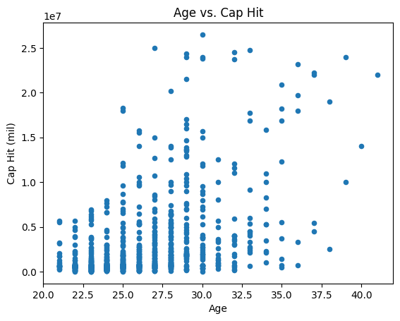
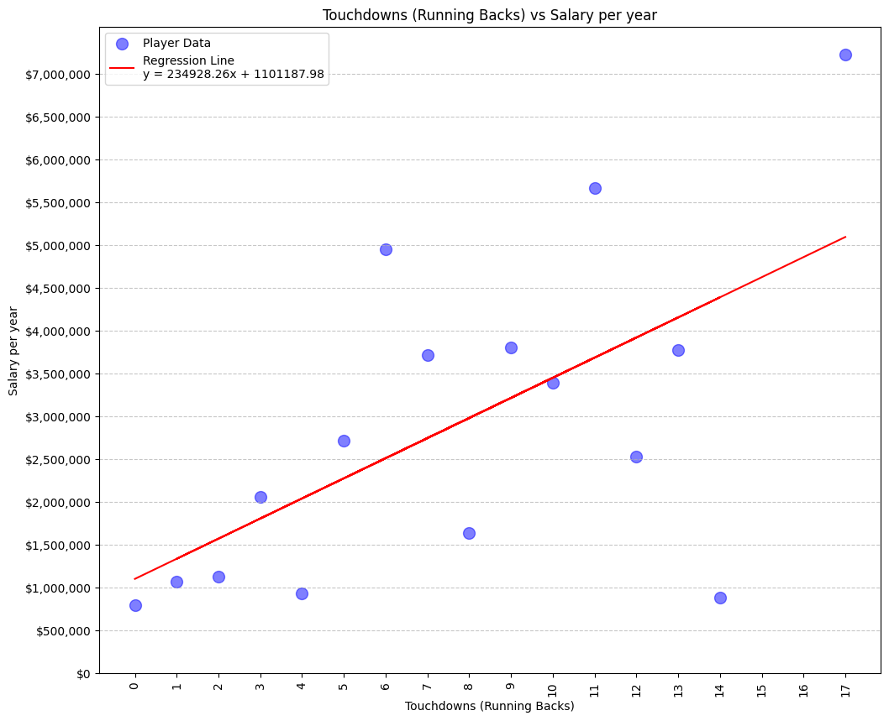

# Running Up the Score: NFL Running Back Salary Forecasting
Running Up the Score is a set a visualizations for Project 1 for the EdX AI Bootcamp 2024.
## Installation
Use the package manager [pip](https://pip.pypa.io/en/stable/) to install pandas, requests, matplot, scipy 
### Pandas
```bash
pip install pandas
```
###
### Requests
```bash
pip install requests
```
### Matplot
```bash
pip install matplotlib
```
### Scipy
```bash
pip install scipy
```

### Required Packages
## Project Overview
### GQ - What are the critical factors that most effectively determine running back cap hit?
- How does age affect cap hit?
- How does position affect cap hit? 
- How does a runningback's touchdowns affect cap hit?
- How does average rush attempts affect cap hit?
- How does total rush yards affect cap hit for runningbacks?
- How do awards affect cap hit?
### Description
Through the synthesis and analysis of several datasets encompassing NFL player position, salary, years of experience, and other player and career details, we will attempt to visualize the correlation between several of these factors, most specifically the significance of running back as a position and whether they typically function as an outlier compared to other positions. Within running back data specifically, we will be looking at correlations between years of experience and salary (which can be compared with a visualization of how years of experience affect salary), production (career rushing yard totals) and salary, etc.

## Results
### Analysis
<p align="center"></p><br/>
<p>The chart supports the claim that players aged 22–30 earn the highest cap hits and that there is a visible decline in both salary and the number of active players beyond age 30.</p>
<p align="center"></p><br/>
<p>Looking at NFL position salaries, running backs (RB) earn approximately $1.5 million per year, placing them in the lower third of the pay scale. This relatively modest compensation compared to quarterbacks at $7 million, or guards and defensive ends at $4-5 million, raises an interesting question: how does actual performance impact RB salaries? This leads us to our next analysis examining the relationship between touchdowns and salary.
</p>
