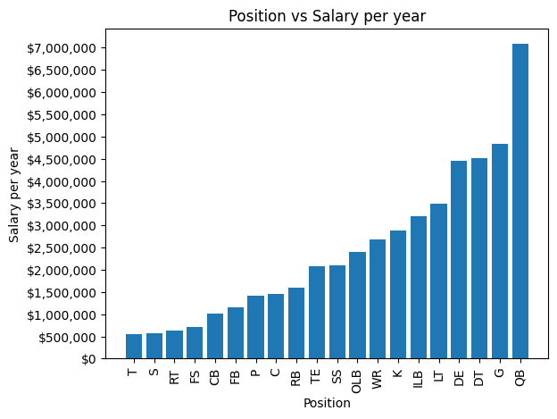
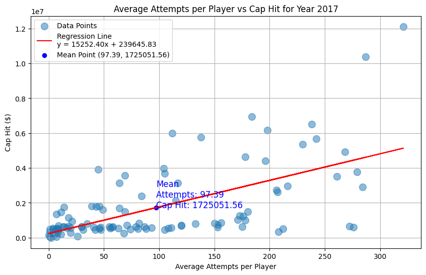
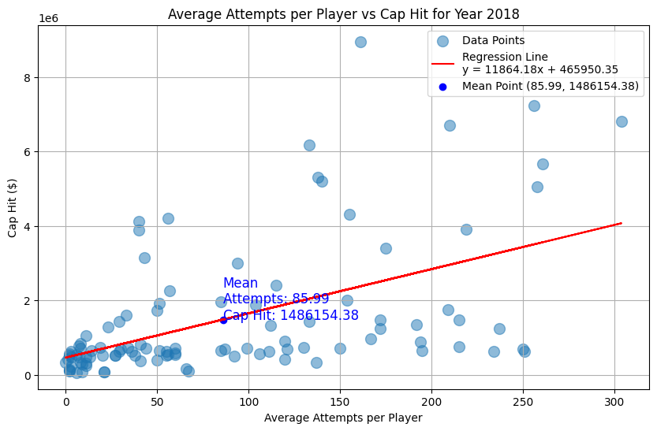
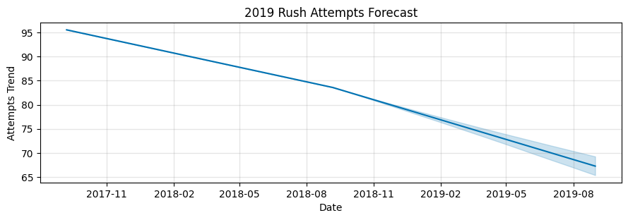
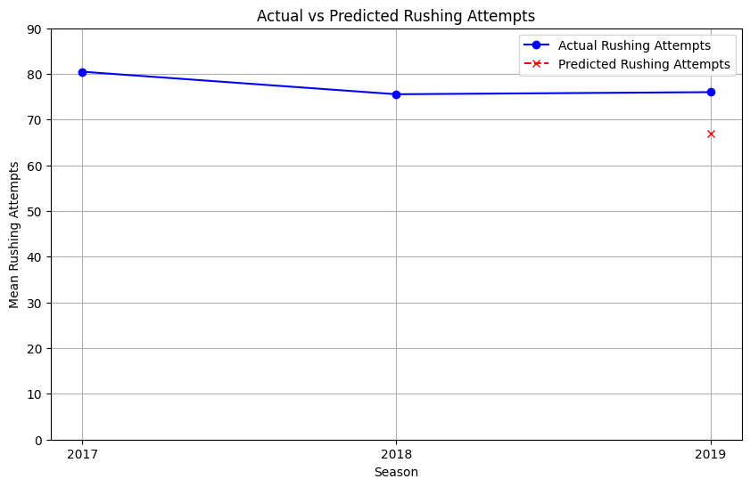

# Running Up the Score: NFL Running Back Salary Forecasting

Running Up the Score is a set a visualizations for Project 1 for the EdX AI Bootcamp 2024.

## Project Overview

### Description

Through the synthesis and analysis of several datasets encompassing NFL player position, salary, years of experience, and other player and career details, we will attempt to visualize the correlation between several of these factors, most specifically the significance of running back as a position and whether they typically function as an outlier compared to other positions. Within running back data specifically, we will be looking at correlations between years of experience and salary (which can be compared with a visualization of how years of experience affect salary), production (career rushing yard totals) and salary, etc.

### GQ - What are the critical factors that most effectively determine running back cap hit?

- How does age affect cap hit?
- How does position affect cap hit?
- How does a runningback's touchdowns affect cap hit?
- How does average rush attempts affect cap hit?
- How does total rush yards affect cap hit for runningbacks?
- How do awards affect cap hit?

## Installation

Use the package manager [pip](https://pip.pypa.io/en/stable/) to install pandas, requests, matplot, scipy, and prophet. Alternatively, you can use this [CoLab link](https://colab.research.google.com/drive/13hsjrGripvLE8_Y0ZHztOG3AET5U0Fp3) to run the code in browser.

#### Pandas

```bash
pip install pandas
```

#### Requests

```bash
pip install requests
```

#### Matplot

```bash
pip install matplotlib
```

#### Scipy

```bash
pip install scipy
```

#### Prophet

```bash
pip install prophet
```

### Cleaning Code

The notebooks in cleaning code where used to produce some of .csv's for used by combining databases, however they are not needed to run the code, as the .csv's are stored throughout the project to be used raw.

## Results

### Analysis

---

<h4 style="text-align: center;">Age Vs Salary</h4>

<p align="center"></p>
<p>  The data display is a scatter plot that aims to visualize the relationship between the age of an NFL running back and their salary cap hit. Each point on the plot represents a single running back.</p>
<p>The chart supports the claim that players aged 22–30 earn the highest cap hits and that there is a visible decline in both salary and the number of active players beyond age 30.</p>
<h4 style="text-align: center;">Position Vs Salary</h4>

<p align="center"></p>
<p>Looking at NFL position salaries, running backs (RB) earn approximately $1.5 million per year, placing them in the lower third of the pay scale. This is a relatively modest amount compared to quarterbacks at $7 million, or guards and defensive ends at $4-5 million.</p>

---

<h4 style="text-align: center;">Touchdowns Vs Salary</h4>
<p align="center"></p>

<p>The analysis shows a definite relationship between running back salaries and their touchdown performance, with an R-value of 0.6155 indicating a moderate positive correlation and a statistically significant P-value of 0.0112. However, while touchdowns are a factor, the R-squared value of 0.3788 suggests that teams consider additional performance metrics and factors when evaluating compensation.</p>

---
<h4 style="text-align: center;">Rush Attempts Vs Salary</h4>
<p>Running back rushing attempts and salary data are grouped by Year, Player, and Position to calculate average Rushing Attempts and Cap Hit per player for the season. The annotation near the regression line highlights the mean rushing attempts and mean cap hit for all players. The regression line, y = mx + b, represents the best linear fit and predicts Cap Hit based on Rushing Attempts.</p>
<table>
  <tr>
    <td style="vertical-align: top; width: 50%; padding-right: 20px;">
        
        <b>2017 Analysis:</b>
        <ol>
          <li>r-value: 0.6120 indicates a moderate positive correlation.</li>
          <li>R-squared: 0.3746 shows 37.46% of the variance in “Cap Hit” is explained by “Rushing Attempts.”</li>
          <li>p-value: 0.0000 confirms the relationship is statistically significant.</li>
        </ol>
    </td>
    <td style="vertical-align: top; width: 50%; padding-left: 20px;">
        
        <b>2018 Analysis:</b>
        <ol>
          <li>r-value: 0.5233 indicates a moderate positive correlation.</li>
          <li>R-squared: 0.2739 shows 27.39% of the variance in “Cap Hit” is explained by “Rushing Attempts.”</li>
          <li>p-value: 0.0000 confirms the relationship is statistically significant.</li>
        </ol>
    </td>
  </tr>
</table>

---

<h4 style="text-align: center;">2019 Rush Attempts Forecast</h4>
<p align="center"></p>
<p>Using the Prophet model, we analyzed rushing data from 2017 and 2018 to forecast 2019 rushing attempts. The trend shows a steady decline from 2017 to 2019, with 2019 expected to see further decreases compared to 2018. In 2017, the mean rushing attempts were 97.39, dropping to 85.99 in 2018.</p>

---

<h4 style="text-align: center;">Rushing Attempts Prediction vs Actual (2019)</h4>
<p align="center"></p>

The **Prophet model** predicted a decline in rushing attempts for 2019, but actual NFL data showed a slight increase, indicating stabilization.  

### Key Notes:
- **Prediction Accuracy**: Past trends may be unreliable due to shifting team strategies.  
- **Data Discrepancies**: Differences between Kaggle/Pro Football Reference data and official NFL stats revealed a larger spread in rushing attempts (2017-2018), potentially biasing the prediction.  

---

<h4 style="text-align: center;">Mean Cap Hit of Different Award Winners</h4>
<p align="center"></p>
<p>
Our visualization on avg. salary (mean cap hit) v. Types of Awards Won supports the observation that player who received awards earn on a higher cap hit.
</p>

---

<h4 style="text-align: center;">Mean Cap Hit of Different Award Winners</h4>
<p align="center"></p>

<p>
Analyzing the relationship between fumbles and salary reveals a weak positive correlation of 0.22, with only 5% of salary variation explained by fumbles. Despite reaching statistical significance, the scattered plot and low R-squared value suggest that fumbles have minimal impact on a player's salary. 

</p>

---

<h4 style="text-align: center;">Comparing Prophet Predictions to Actual Rushing Yards for 2017-2018</h4>
<p align="center"></p>
<p>
Using prophet, we predicted 2019 mean rushing yards and compared them to actual results. Prophet predicted 340 mean rushing yards for 2019 when the actual was 324 mean rushing yards. The actual mean rushing yards decreased more than the predicted rushing yards.
</p>

---

<h4 style="text-align: center;">Runningback's Cap Hit versus Rushing Yards</h4>
<p align="center"></p>
<p>
The regression of Total Rush Yards v. Salary Cap Hit revealed an r-value of 0.5325 meaning the total rush yards of NFL running backs has a moderate positive correlation to cap hit. The p-value of 0.0002 supports the statistical significance of the finding. This means that Total rushing yards is a significant component in determing a NFL player's salary.
</p>

# Data
We pulled data from several sources and merged the data together. The sources we used are as follows:
- [Kaggle](https://www.kaggle.com/datasets/f4k25g/nfl-salaries) - for 2014 thru 2020 Running back salary data
- [Pro Football Reference](https://www.pro-football-reference.com/years/2017/rushing.htm) - 2017-2018 running Player statistics
- [Official NFL Stats](https://www.nfl.com/stats/player-stats/category/rushing/2017/REG/all/rushingyards/DESC) - 2017-2019 Actual NFL Player statistics
- [Stathead](https://stathead.com/football/player-season-finder.cgi?request=1&year_min=2017&year_max=2017&positions%5B%5D=rb) - 2017-2018 Player position data
